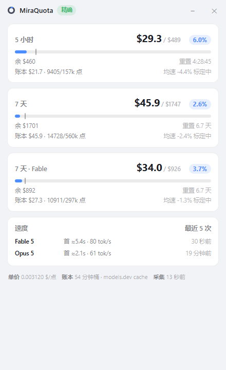
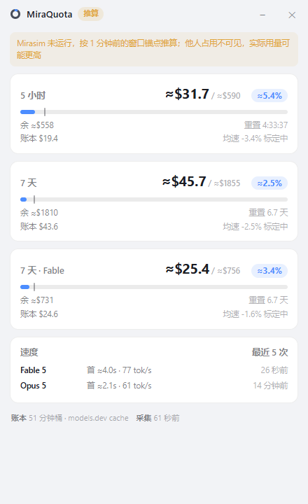
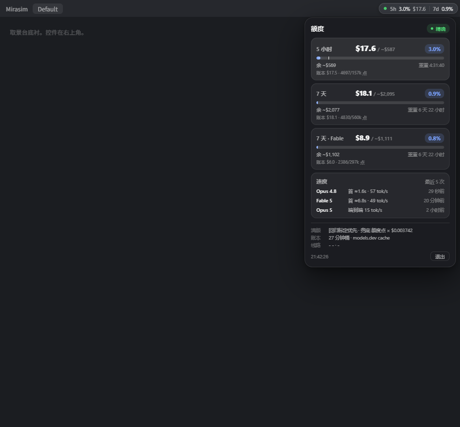

<h1 align="center">MiraQuota for Windows</h1>

<p align="center">
<b>Mirasim 的额度监控</b>：5 小时 / 7 天额度窗口折算成美元口径。<br>
主形态是<b>独立桌面应用</b>（托盘常驻）——Mirasim 关闭时也能按窗口锚点推算剩余。
</p>

<p align="center">


</p>

<p align="center">


</p>
<p align="center"><sub>左：Mirasim 在线，/v1/limits 精确点数。右：Mirasim 关闭，按锚点推算（数字带 ≈，橙色「推算」徽章）。</sub></p>

## 桌面应用（主形态）

```powershell
pnpm install        # 依赖只有 electron / electron-builder（.npmrc 已配 npmmirror）
pnpm dev            # 开发运行（终端若带 ELECTRON_RUN_AS_NODE 需先清掉）
pnpm dist           # 打包：版本 = 0.2.<git 提交数>（安装版 + 免安装 exe）
```

- **托盘常驻**：关窗即收到托盘，悬停看摘要，右键可设开机自启；
- **独立于 Mirasim**：Mirasim 在线时走 `/v1/limits` 精确点数（会话令牌 PEB 自动发现）；
  关闭时按落盘的窗口锚点滚动推算，剩余额度仍可读（标 ≈，他人占用不可见故为下界）；
- **美元口径**：本机账本（Claude Code transcript + Mirasim 网关）折算，满额自标定，
  跨窗口自洽核验，详见 [docs/QUOTA-ESTIMATION.md](docs/QUOTA-ESTIMATION.md)。
- **模型家族计费**：顶部按本机实际使用过的官方云端模型动态生成 `Claude / GPT / …`
  选择；Fable、Opus、Sonnet、Haiku 统一归为 Claude，GPT 各版本统一归为 GPT。
  原有官方额度卡全部保留，选择只改变本机美元花费的家族归集。
- **模型任务明细**：速度区显示最近使用过的 5 种具体模型（包括本地、直连与辅助模型），
  每种模型可展开最近 5 个已完成任务；当前计费家族的每条具体模型行重复显示标记。

## 注入控件（副形态，可选）

同一套数据引擎也可作 CLI provider 跑，把上游的控件经 CDP 注入 Mirasim 界面
（需 Mirasim 带 `--remote-debugging-port` 启动）：

<p align="center"></p>

这是 macOS 版 [MiraQuota](https://github.com/Heartcoolman/MiraQuota) 的 **Windows 实现**。
界面控件与它的数据契约本就与平台无关，故控件（`widget/miraquota-widget.js`）**原样复用**；
Windows 特有的部分——喂数据的常驻进程（provider）——用 Node 重写，并补齐 macOS 版有、
而上游 Node 参考实现缺的那一半（美元折算、满额标定、速度卡），外加一处 Windows 增强：
**会话令牌自动发现**。

## 相对上游参考 provider 的增量

上游 [`provider-node`](https://github.com/Heartcoolman/MiraQuota/tree/main/provider-node) 只覆盖不依赖账本的一半，
且在 Windows 上要求手工传会话令牌。本项目补齐全部功能：

| 能力 | 上游 Node 参考 | 本项目 |
|---|---|---|
| 额度点、百分比、重置倒计时、均速游标 | ✅ | ✅ |
| **会话令牌** | ⚠️ 需手工 `--router-token` | ✅ **PEB 内存读取自动发现** |
| 美元金额、每点单价 | ❌ | ✅ 解析本机账本反推 |
| 满额标定（`支出 ÷ 点数增量 × 预算点`） | ❌ | ✅ 点数口径 |
| 账本与点数不自洽检测 | ❌ | ✅ 跨窗口交叉验证 |
| 打满时刻外推 | ❌ | ✅ 近 1 小时点增速 |
| 耗尽预演（整窗均速 + 自定义每天用 N 小时） | ❌ | ✅ 活跃分钟计时，面板可调 N |
| 单价公式透明（账本$ ÷ 点数 + 跨窗校验离散） | ❌ | ✅ 页脚展示推导 |
| 出字速度、首 token、在途「生成中」 | ❌ | ✅ Theil–Sen 回归 |

### 会话令牌自动发现（关键）

现行 Mirasim 的 `/v1/limits` 要带会话令牌，该令牌只在 Mirasim 拉起的会话进程的环境变量里。
macOS 用 `ps eww` 读得到；Windows 的 `Get-CimInstance` 不暴露进程环境——上游因此要求手工传。

本项目用 **PEB 内存读取**（`NtQueryInformationProcess` 取 PEB 基址，沿
`ProcessParameters → Environment` 读出目标进程环境块）还原自动发现，同用户、同完整性级别
无需管理员。实测（Win11 x64）能稳定读出会话端口与令牌配对。取不到时退回 relay 帧口径。
详见 [`provider/lib/session-token.mjs`](provider/lib/session-token.mjs)。

## 系统要求

| 项 | 要求 |
|---|---|
| 操作系统 | Windows 10 / 11 |
| 运行时 | Node 22+（`fetch` 与 `WebSocket` 自 22 起是全局的），无需 `npm install` |
| 宿主 | Mirasim 桌面版在本机运行，并以 `--remote-debugging-port` 启动（见下），否则控件不出现 |
| 美元口径 | 由本机账本折算：`~/.claude/projects/*.jsonl`（Claude Code）与 `~/.mirasim/insights/usage-*.ndjson`（网关）；两处皆空时点数与百分比照常，仅美元缺失 |

## 快速开始

```powershell
# 1. 让 Mirasim 带调试端口启动（否则控件无处注入）
powershell -ExecutionPolicy Bypass -File scripts\mirasim-debug.ps1

# 2. 起 provider（令牌自动发现，无需手工传）
node provider\miraquota-provider.mjs

# 自检：取一次并打印，不起服务、不注入
node provider\miraquota-provider.mjs --once
```

控件随即出现在 Mirasim 标题栏最右侧的空白段，点击展开。

### 桌面图标（免敲命令）

控件是嵌进 Mirasim 界面的，**没有独立窗口，也不该有托盘图标**。为免每次敲命令，
可在桌面放两个快捷方式：

```powershell
powershell -ExecutionPolicy Bypass -File scripts\make-shortcuts.ps1
```

- **Mirasim 带额度控件启动**：带调试端口重启 Mirasim（控件随即出现）
- **额度控件 provider**：启动后台供数进程（无窗口）

### 登录自启

```powershell
powershell -ExecutionPolicy Bypass -File scripts\install.ps1      # 注册登录触发的计划任务
powershell -ExecutionPolicy Bypass -File scripts\install.ps1 -Uninstall
```

## 不重启 Mirasim 的界面预览

改控件样式、或想在不打扰当前会话的情况下看控件长什么样时，用取景台——它按宿主的样子
铺一层底，加载控件，数据取自本机 provider 的 feed：

```powershell
node provider\miraquota-provider.mjs --no-inject --feed-port 4996    # 只供数据不注入
# 另起一个静态服务伺服 scripts/，浏览器打开 widget-preview.html?theme=dark&open=1
```

`docs/` 下的三张图即由取景台出：[暗色含速度](docs/preview-dark-speed.png)、
[暗色额度](docs/preview-dark-open.png)、[亮色](docs/preview-light-open.png)。

## 架构

```
provider（常驻进程，Node）
 ├─ 采数：/v1/limits 原始额度点（令牌 PEB 自动发现）+ 本机账本文件
 ├─ 算数：美元折算 / 满额标定 / 单价自洽 / 速度回归
 ├─ 供数：回环 HTTP 上挂 quota.json           ── 契约 A
 └─ 注入：CDP 巡检，把 widget.js 送进渲染进程   ── 契约 B
                     │
widget（原样复用，Shadow DOM，纯 JS）
 └─ 每 5 秒 fetch quota.json 绘制
```

两份契约的完整定义见上游 [docs/ARCHITECTURE.md](https://github.com/Heartcoolman/MiraQuota/blob/main/docs/ARCHITECTURE.md)。
provider 各模块：

| 文件 | 职责 |
|---|---|
| `provider/miraquota-provider.mjs` | 主流程：feed + CDP 注入 + 数据组装 |
| `provider/lib/session-token.mjs` | **会话令牌 PEB 自动发现（Windows）** |
| `provider/lib/pricing.mjs` | 价目表（models.dev 缓存 + 内置回退） |
| `provider/lib/ledger.mjs` | 账本美元：双源去重、scoped 分桶、增量扫描 |
| `provider/lib/calibrator.mjs` | 满额标定（点数口径） |
| `provider/lib/coherence.mjs` | 每点单价与跨窗口自洽核验 |
| `provider/lib/speed.mjs` | 出字速度、首 token、在途 |
| `provider/lib/windows.mjs` | 窗口标签工具 |

额度预估口径的取舍与实测验证见 [docs/QUOTA-ESTIMATION.md](docs/QUOTA-ESTIMATION.md)。

## 免责

非官方项目，与 Mirasim、Anthropic 无关。不修改 Mirasim 任何文件；PEB 读取仅访问本用户自己的
进程环境，用于取本机会话令牌。控件与数据契约、macOS 完整实现版权归上游 MiraQuota 作者（MIT）。
